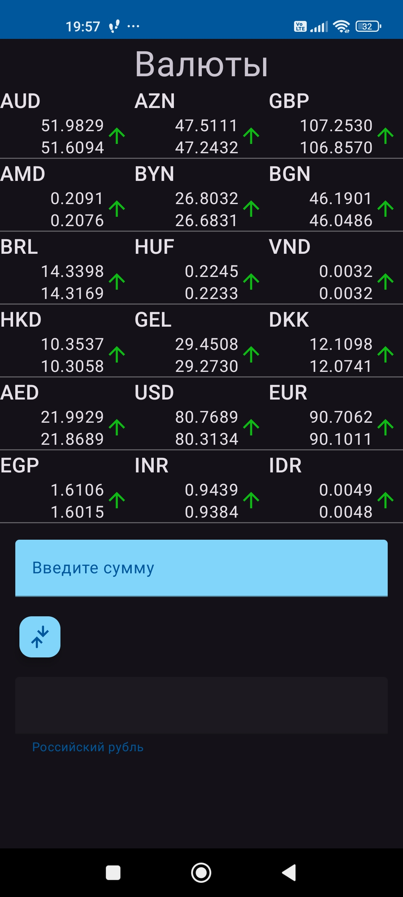
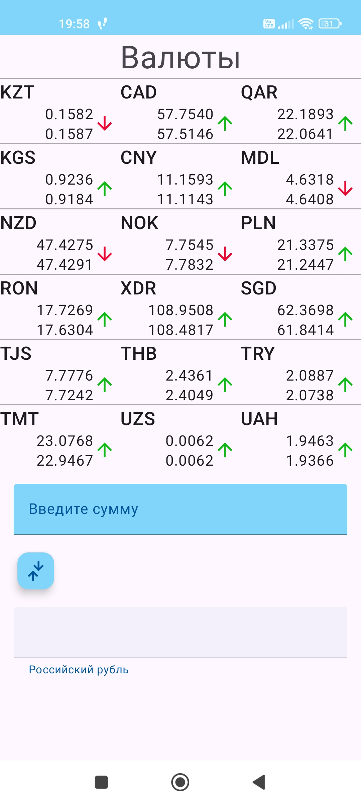
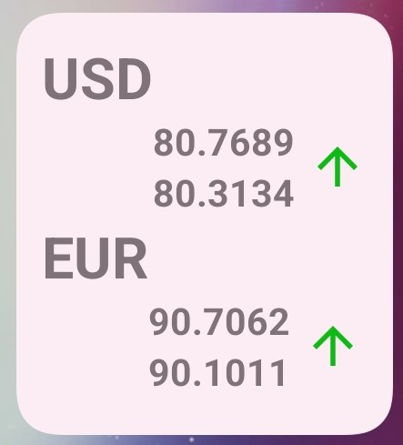

Приложение конвертер валют.
+ Загружает валюты с https://www.cbr-xml-daily.ru/daily_json.js с помощью Retrofit
+ Сохраняет данные в базе данных для доступа к валютам без интерента с помощью Room
+ RecyclerView обновляется через swipe-refresh
+ Реализован виджет для быстрого просмотра двух валют - евро и доллар
+ Каждые 12 часов данные о валютах обновляются с помощью WorkManager
+ Все сетевые запросы производятся с помощью Coroutines
+ Инжект зависимостей производится с помощью Dagger2

